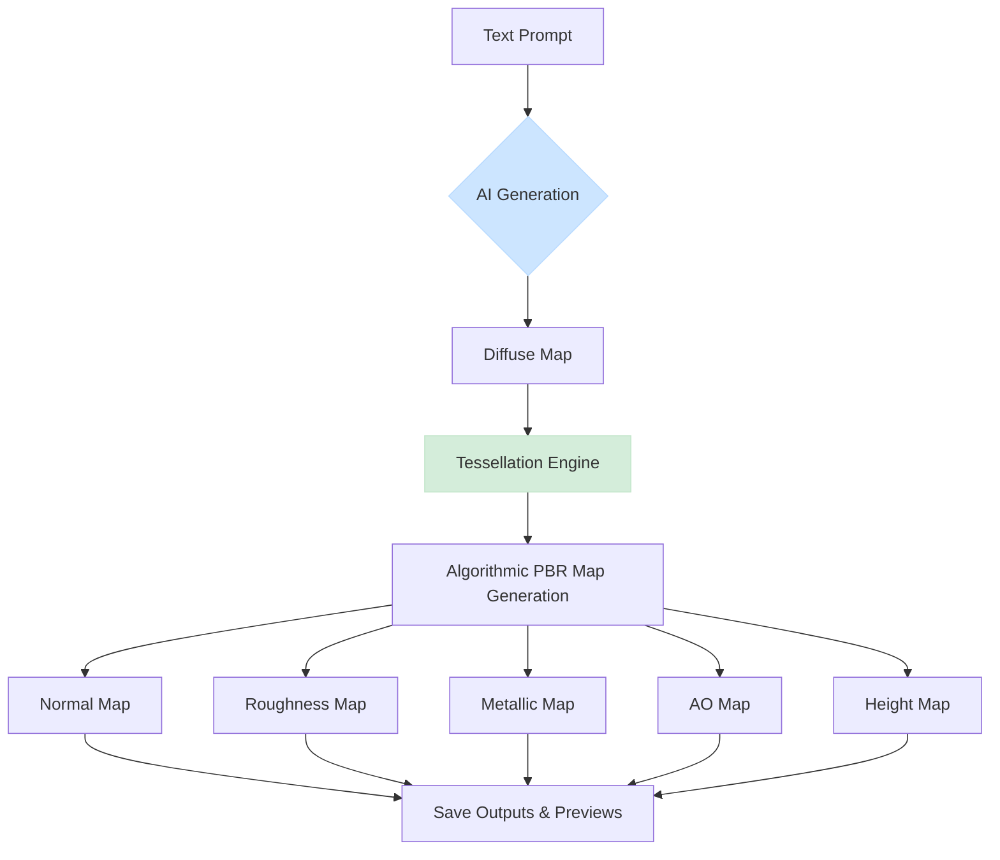

# Tessellating PBR Texture Generator Architecture

## Overview
An AI-powered Python system for generating seamlessly tessellating PBR (Physically Based Rendering) textures. The workflow begins with a text prompt that is sent to an AI image generator (e.g., DALL-E) to create a diffuse map. This map is then used as the base for algorithmically deriving a full set of PBR textures.

## System Architecture (Python Implementation)

### Core Modules

#### 1. Core Generator (`src/core/generator.py`)
- **Purpose**: Main orchestrator for the AI-to-PBR generation pipeline.
- **Responsibilities**:
  - Load and validate configuration.
  - Call the AI API to generate the initial diffuse map from a text prompt.
  - Coordinate the algorithmic generation of other PBR maps.
  - Manage the entire generation workflow.
- **Key Methods**:
  - `generate_textures_with_progress(config: Config) -> List[Result]`
  - `generate_diffuse_map(config: Config) -> Image`

#### 2. AI Interface (`src/interfaces/openai_api.py`)
- **Purpose**: Handles communication with the OpenAI API.
- **Responsibilities**:
  - Build the prompt for the AI model.
  - Send requests to the DALL-E API.
  - Handle API responses and errors.
  - Decode the returned image data.

#### 3. Base Texture Processor (`src/modules/base.py`)
- **Purpose**: Abstract base class for all algorithmic texture processors.
- **Responsibilities**:
  - Define a common interface for PBR map generation.
  - Handle image loading, processing, and saving.

#### 4. Diffuse Module (`src/modules/diffuse.py`)
- **Purpose**: Handles the AI-generated diffuse texture.
- **Responsibilities**:
  - Receives the image data from the AI interface.
  - Applies initial color corrections or filters if needed.
  - Serves as the input for the tessellation engine and other PBR modules.

#### 4. Normal Map Generator (`src/modules/normal.py`)
- **Purpose**: Generate normal maps from diffuse/height data
- **Responsibilities**:
  - Convert grayscale height to normals
  - Apply Sobel filters for edge detection
  - Normalize and encode to RGB
  - Support configurable strength
- **Key Features**:
  - Multi-scale detail extraction
  - Configurable normal strength (0.1-5.0)
  - Blue channel optimization

#### 5. Roughness Estimator (`src/modules/roughness.py`)
- **Purpose**: Estimate surface roughness from diffuse
- **Responsibilities**:
  - Analyze texture patterns
  - Extract high-frequency details
  - Apply contrast adjustments
  - Generate grayscale roughness map
- **Algorithm**:
  - Luminance-based analysis
  - Edge detection for detail
  - Configurable contrast (0.5-2.0)

#### 6. Metallic Map Creator (`src/modules/metallic.py`)
- **Purpose**: Generate metallic maps
- **Responsibilities**:
  - Analyze color for metallic properties
  - Apply threshold-based detection
  - Support manual overrides
  - Create binary or gradient maps
- **Detection Methods**:
  - Color saturation analysis
  - Brightness thresholding
  - Material-specific presets

#### 7. Ambient Occlusion (`src/modules/ambient_occlusion.py`)
- **Purpose**: Synthesize ambient occlusion maps
- **Responsibilities**:
  - Generate cavity/crevice darkening
  - Multi-scale occlusion
  - Edge-aware filtering
  - Intensity control
- **Techniques**:
  - Height-based occlusion
  - Screen-space approximation
  - Gaussian blur passes

#### 8. Height Map Generator (`src/modules/height.py`)
- **Purpose**: Create displacement/height maps
- **Responsibilities**:
  - Convert diffuse to grayscale height
  - Apply curve adjustments
  - Generate displacement data
  - Support 16/32-bit output
- **Processing**:
  - Luminance extraction
  - Contrast enhancement
  - Optional blur for smoothing

#### 9. Tessellation Engine (`src/modules/tessellation.py`)
- **Purpose**: Ensure seamless tiling for all textures
- **Responsibilities**:
  - Apply tiling algorithms
  - Remove visible seams
  - Generate preview tiles
  - Support multiple methods
- **Algorithms**:
  - **Mirror**: Edge mirroring with blend
  - **Offset**: 50% offset with cross-fade
  - **Frequency**: Frequency domain blending

### Data Flow (AI-Driven Implementation)



**Detailed Pipeline:**

1.  **Prompt Input**: The process starts with a user-provided text prompt describing the desired material.
2.  **AI Generation**: The prompt is sent to the OpenAI API, which returns a diffuse texture image.
3.  **Tessellation**: The AI-generated diffuse map is made seamlessly tileable using one of the available algorithms.
4.  **Algorithmic Derivation**: The seamless diffuse map is used as a base to generate all other PBR maps (Normal, Roughness, etc.) in parallel.
5.  **Export**: All generated textures and their tiled previews are saved to the output directory.

### Key Classes and Interfaces (Python)

#### Config Structure
```python
@dataclass
class Config:
    project: ProjectConfig
    textures: TextureConfig
    generation: GenerationConfig
    output: OutputConfig
    logging: LoggingConfig
```

#### Texture Processing
```python
class BaseTextureProcessor(ABC):
    @abstractmethod
    def process(self, image: Image) -> Image:
        """Process texture and return result"""
        pass

    def apply_tessellation(self, image: Image) -> Image:
        """Apply seamless tiling"""
        return self.tessellator.make_seamless(image)
```

#### Generation Options
```python
@dataclass
class GenerationConfig:
    tessellation: TessellationConfig
    normal: NormalConfig
    roughness: RoughnessConfig
    metallic: MetallicConfig
    ao: AOConfig
    height: HeightConfig
```

#### Tessellation Algorithms
```python
class TessellationProcessor:
    def make_seamless(self,
                     image: Image,
                     algorithm: str = 'mirror',
                     blend_width: int = 64) -> Image:
        """Apply seamless tiling algorithm"""
        # Returns seamlessly tiling texture
```

### Processing Pipeline Details

#### 1. Tessellation Stage
The tessellation engine is the heart of seamless texture generation:

```python
# Mirror Algorithm
- Blend edges with mirrored version
- Configurable blend width (8-256 pixels)
- Best for organic/natural textures

# Offset Algorithm
- Shift by 50% and blend overlaps
- Cross-fade at boundaries
- Good for geometric patterns

# Frequency Algorithm
- FFT-based edge blending
- Preserves high-frequency details
- Best for complex textures
```

#### 2. Normal Map Generation
```python
# Multi-scale approach:
1. Generate base normals from height
2. Extract fine details from diffuse
3. Combine at multiple scales
4. Normalize and encode to RGB
```

#### 3. PBR Map Derivation
```python
# Parallel processing:
- Normal: Sobel filter + height analysis
- Roughness: Frequency analysis + contrast
- Metallic: Color analysis + thresholds
- AO: Multi-blur cavity detection
- Height: Luminance + curve adjustment
```

### Configuration System

Hierarchical configuration with CLI overrides:

```python
# Priority order (highest to lowest):
1. CLI arguments (--resolution, --output, etc.)
2. Custom config file (--config path/to/config.json)
3. Default config (config/default.json)
4. Hard-coded defaults
```

Key configuration sections:
- `textures`: Resolution, formats, types
- `generation`: Algorithm parameters
- `output`: Paths, naming, previews
- `logging`: Verbosity, debug mode

### Performance Optimizations

1. **Parallel Processing**: All PBR maps generated concurrently
2. **Memory Efficiency**: Streaming for large textures
3. **Caching**: Reuse tessellation results
4. **SIMD Operations**: NumPy vectorization
5. **Lazy Loading**: Load only required modules

### Error Handling

1. **Input Validation**: Check file formats, dimensions
2. **Memory Guards**: Prevent OOM for large textures
3. **Graceful Degradation**: Skip failed maps, continue others
4. **Detailed Logging**: Track all operations
5. **User Feedback**: Clear error messages

### Future Enhancements

- GPU acceleration for large textures
- Machine learning-based map generation
- Real-time preview server
- Material preset library
- Batch processing UI