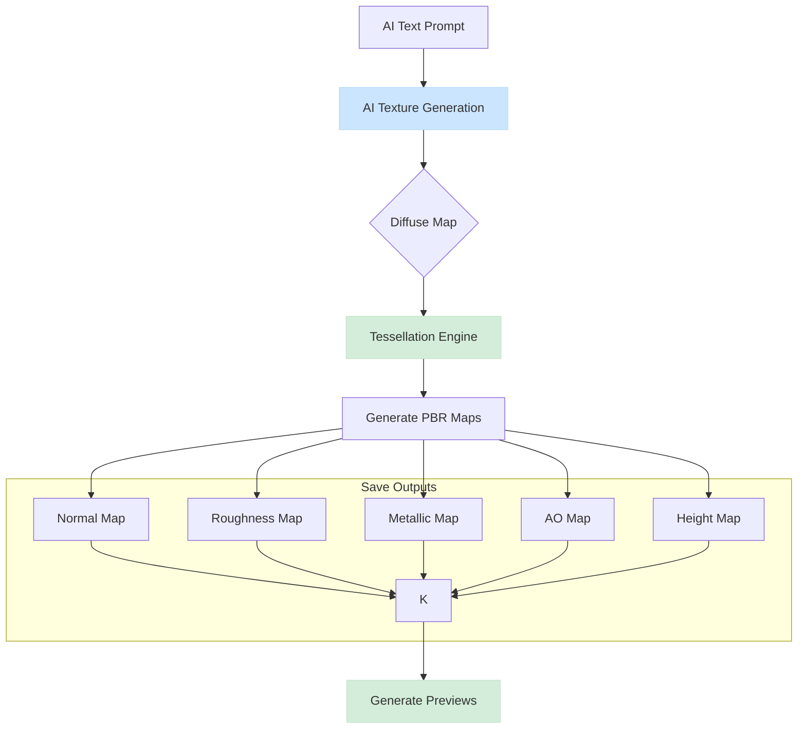

<div align="center">

# Tessellating PBR Texture Generator

**An AI-Powered Tool for Generating Seamless, Game-Ready PBR Textures**

</div>

<div align="center">

[](https://opensource.org/licenses/MIT)
[](https://www.python.org/downloads/)
[](https://github.com/your-username/tessellating-pbr-generator)

</div>

---

## 🚀 Current Status: In Development

The **Tessellating PBR Texture Generator** is a Python tool that uses AI to generate a base diffuse texture from a text prompt, and then algorithmically derives a full, seamlessly tileable PBR (Physically Based Rendering) material set from it.

The project is currently in **active development**. The core AI-to-PBR pipeline is functional, but many features are still being refined, and the documentation is being updated to reflect the recent pivot from a user-provided texture workflow to an AI-driven one.

### Project Background

Originally a TypeScript project, the tool has been completely reimplemented in Python to leverage its powerful image processing and scientific computing libraries. The core workflow is now centered around generating an initial concept with AI and then applying deterministic algorithms for the remaining PBR maps.

## ✨ Key Features

-   🤖 **AI-Powered Texture Generation**: Uses providers like OpenAI's DALL-E to generate an initial diffuse map from a text prompt.
-   🎨 **Algorithmic PBR Map Generation**: Automatically generates Normal, Roughness, Metallic, Ambient Occlusion, and Height maps from the AI-generated diffuse texture.
-   🖼️ **Guaranteed Seamless Tiling**: Employs multiple advanced algorithms (mirror, offset, frequency blend) to ensure generated textures are perfectly tileable.
-   ⚙️ **Advanced Configuration**: Use JSON files to define material properties, AI settings, and generation parameters.
-   🚀 **Command-Line Interface**: A comprehensive CLI allows for easy generation and parameter overrides.
-   🧩 **Modular Python Architecture**: Built with a clean, extensible structure that separates concerns.

## 🖼️ Example Output

The generator takes a text prompt, creates a diffuse texture with AI, and then derives the complete PBR material set.

| Texture Type  | Description                         |
| :------------ | :---------------------------------- |
| **Diffuse**   | AI-generated color texture          |
| **Normal**    | Surface detail and bump information |
| **Roughness** | Surface micro-facet roughness       |
| **Metallic**  | Metal/dielectric material properties|
| **AO**        | Ambient occlusion for shadows       |
| **Height**    | Displacement/parallax mapping data  |

## 🏁 Getting Started

### Prerequisites

-   Python 3.9+
-   An OpenAI API Key (or another supported AI provider)

### Installation & Setup

1.  **Clone the repository:**
    ```sh
    git clone https://github.com/your-username/tessellating-pbr-generator.git
    cd tessellating-pbr-generator
    ```

2.  **Create a virtual environment and install dependencies:**
    ```sh
    python3 -m venv .venv
    source .venv/bin/activate  # On Windows use `.venv\Scripts\activate`
    pip install -r requirements.txt
    ```

3.  **Set up your API Key:**
    Copy the example environment file and add your OpenAI API key.
    ```sh
    cp .env.example .env
    # Now edit the .env file and add your key:
    # OPENAI_API_KEY="sk-..."
    ```

4.  **Verify installation:**
    ```sh
    python main.py --help
    ```

## 🚀 Usage

The primary way to use the generator is via the CLI, providing a text prompt for the material you want to create.

### Basic Generation

Generate a complete PBR set by describing a material.

```sh
# Generate a stone texture using a text prompt
python main.py --material "A photorealistic, weathered cobblestone ground with moss growing in the cracks."

# Generate a metallic texture
python main.py --material "Scratched and worn brushed steel surface."
```

### Advanced Usage

You can override settings from the configuration file using CLI arguments.

```sh
# Generate a specific texture at 2K resolution with a specific algorithm
python main.py \
    --material "Old, weathered wood planks with peeling paint" \
    --resolution 2048x2048 \
    --output ./output/wood_pbr \
    --types normal roughness ao height \
    --preview
```

### CLI Options

| Option         | Description                               | Default             |
| :------------- | :---------------------------------------- | :------------------ |
| `-m`, `--material` | Text prompt describing the material.      | From config         |
| `-c`, `--config`   | Path to a custom configuration file.      | `config/default.json` |
| `-o`, `--output`   | Output directory for generated textures.  | `./output`          |
| `-r`, `--resolution`| Output resolution (e.g., `2048x2048`).  | `1024x1024`         |
| `--types`      | A space-separated list of texture types to generate. | All types           |
| `--preview`    | Generate a 2x2 tiled preview image.       | `false`             |
| `--debug`      | Enable debug logging.                     | `false`             |


## 🏛️ Architecture

The project features a modular architecture centered around an AI-driven generation pipeline.

### Generation Pipeline



For more implementation details, see [ARCHITECTURE.md](./ARCHITECTURE.md).

## 🧪 Testing

The project includes a comprehensive test suite using `pytest`.

**Note**: The testing documentation in the `/docs/testing` directory is **outdated** and refers to the previous TypeScript implementation. Please use the commands below.

### Running Python Tests

```sh
# Run all tests
python -m pytest

# Run with coverage report
python -m pytest --cov=src
```

## 🤝 Contributing

Contributions are welcome! Please see `CONTRIBUTING.md` for guidelines.

## 📄 License

Distributed under the MIT License. See `LICENSE` for more information.