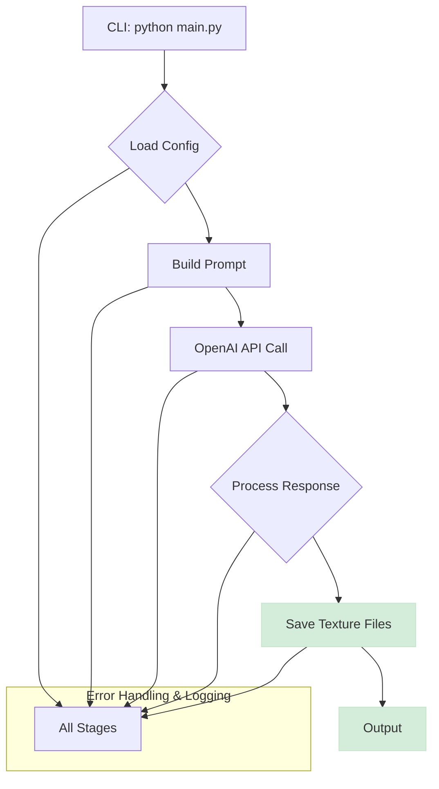

Of course! Here is a comprehensive, world-class GitHub README for the "Tessellating PBR Generator" project, crafted from the provided file structure and code.

---

<div align="center">

<!-- You can replace this with a project-specific banner image -->


# Tessellating PBR Texture Generator

**AI-Powered Generation of Seamless, Game-Ready PBR Textures**

</div>

<div align="center">

[](https://github.com/your-username/tessellating-pbr-generator/actions)
[](https://codecov.io/gh/your-username/tessellating-pbr-generator)
[](https://opensource.org/licenses/MIT)
[](https://www.python.org/downloads/)
[](https://nodejs.org/)

</div>

---

The **Tessellating PBR Texture Generator** is a powerful, AI-driven tool designed to automate the creation of high-quality, seamlessly tileable PBR (Physically Based Rendering) materials. It leverages generative AI to transform simple text descriptions into complete, game-ready texture sets, drastically reducing the time and effort required for 3D asset creation, game development, and architectural visualization.

This project combines a robust Python backend for core generation logic with a sophisticated TypeScript/Node.js testing suite and modular pipeline architecture.

## ✨ Key Features

-   🎨 **AI-Powered PBR Generation**: Utilizes OpenAI's DALL-E models to generate a full set of PBR maps: Diffuse, Normal, Roughness, Metallic, Ambient Occlusion, and Height.
-   🖼️ **Guaranteed Seamless Tiling**: Employs advanced prompt engineering and is designed to produce textures that tile perfectly, eliminating visible seams.
-   ⚙️ **Highly Configurable**: Control every aspect of generation via a simple JSON configuration file, including resolution, texture formats, material properties, and output conventions.
-   🚀 **Command-Line Interface**: Easy-to-use CLI for running generation tasks, overriding configurations, and specifying materials on the fly.
-   🧩 **Modular Architecture**: A clean separation of concerns between the Python generation core and the TypeScript pipeline/testing framework. See the [Architecture Document](./ARCHITECTURE.md) for details.
-   🧪 **World-Class Testing Suite**: A comprehensive testing strategy ensures reliability, performance, and quality. Includes unit, integration, performance, and visual regression tests.
-   💡 **Advanced Prompt Engineering**: An internal prompt engine optimizes user descriptions with tessellation-specific keywords and PBR-aware language to achieve the best results.

## 🖼️ Example Gallery

Below are some examples of what you can create with a simple text prompt.

| Prompt: "Ancient cobblestone street, weathered, with moss growth" |
| :---------------------------------------------------------------: |
| _(Image of a 3D sphere with generated cobblestone texture)_         |

| Prompt: "Brushed aluminum panel with light scratches" |
| :----------------------------------------------------: |
| _(Image of a 3D sphere with generated aluminum texture)_ |

## 🏁 Getting Started

Follow these instructions to get the project up and running on your local machine.

### Prerequisites

-   Python 3.9+
-   Node.js 18.x+ and npm
-   An OpenAI API Key

### Installation & Setup

1.  **Clone the repository:**
    ```sh
    git clone https://github.com/your-username/tessellating-pbr-generator.git
    cd tessellating-pbr-generator
    ```

2.  **Install Python dependencies:**
    ```sh
    pip install -r requirements.txt
    ```

3.  **Install Node.js dependencies (for testing and development):**
    ```sh
    npm install
    ```

4.  **Configure your environment variables:**
    -   Copy the example `.env` file:
        ```sh
        cp .env.example .env
        ```
    -   Edit the new `.env` file and add your OpenAI API key:
        ```env
        # .env
        OPENAI_API_KEY=your_openai_api_key_here
        ```

## 🚀 Usage

The primary way to use the generator is through its command-line interface.

### Basic Generation

To run a generation with the default settings specified in `config/default.json`:

```sh
python main.py
```

This will generate a PBR texture set for a "stone" material at 1024x1024 resolution.

### Overriding Configuration via Flags

You can easily override default settings using command-line arguments.

```sh
# Generate a photorealistic weathered brick wall at 2K resolution
python main.py \
    --material "photorealistic weathered brick wall" \
    --resolution "2048x2048" \
    --output "./my_textures" \
    --types diffuse normal roughness height

# Enable debug logging
python main.py --debug
```

### Using a Custom Configuration File

For complex or reusable setups, you can point the generator to a custom JSON configuration file.

1.  Create a file like `my_cobblestone_material.json`:
    ```json
    {
      "project": { ... },
      "textures": {
        "resolution": { "width": 2048, "height": 2048 },
        "format": "png",
        "types": ["diffuse", "normal", "roughness", "ao", "height"]
      },
      "material": {
        "base_material": "Ancient cobblestone street with moss growth and worn edges",
        "style": "photorealistic",
        "seamless": true,
        "properties": {
          "roughness_range": [0.6, 0.9],
          "metallic_value": 0.0
        }
      },
      ...
    }
    ```
2.  Run the generator with the `--config` flag:
    ```sh
    python main.py --config ./path/to/my_cobblestone_material.json
    ```

## 🔧 Configuration

The generator's behavior is controlled by `config/default.json`. You can modify this file or create your own.

| Section      | Key                 | Description                                                               |
| :----------- | :------------------ | :------------------------------------------------------------------------ |
| **textures** | `resolution`        | The width and height of the output textures (e.g., `1024`, `2048`).       |
|              | `format`            | The output file format (`png`, `jpg`, `tiff`, `exr`).                     |
|              | `types`             | An array of PBR maps to generate (`diffuse`, `normal`, `ao`, etc.).       |
| **material** | `base_material`     | The core text description of the material.                                |
|              | `style`             | The artistic style (`realistic`, `stylized`, etc.).                       |
|              | `seamless`          | Whether to prompt for a seamless texture (always recommended).            |
|              | `properties`        | Fine-tune material characteristics like `roughness_range`.                |
| **generation**| `model`             | The AI model to use for generation (e.g., `dall-e-3`).                    |
| **output**   | `directory`         | The root folder where generated textures will be saved.                   |
|              | `naming_convention` | A template for naming output files.                                       |
|              | `create_preview`    | If `true`, a preview image will be generated.                             |

## 🧪 Testing

This project is committed to quality and includes a comprehensive testing suite. Our goal is to maintain >95% code coverage and ensure all features are robust and performant.

For a deep dive, see our [Comprehensive Test Strategy](./docs/testing/comprehensive-test-strategy.md).

### Running Tests

To run the tests, you'll need the Node.js dependencies installed (`npm install`).

```sh
# Run all tests (unit, integration, etc.)
npm test

# Run only unit tests with code coverage
npm run test:unit:coverage

# Run integration tests (requires a valid API key for some tests)
npm run test:integration

# Run performance benchmarks
npm run test:performance
```

For a complete list of commands and debugging tips, see the [Test Execution Guide](./docs/testing/test-execution-guide.md).

## 🏛️ Architecture

The project is a hybrid system designed to leverage the strengths of both Python and TypeScript.

-   **Python Core**: Handles the primary, user-facing generation logic. It's responsible for configuration loading, interfacing with the OpenAI API, and file management. This is what you interact with via `main.py`.
-   **TypeScript/Node.js Suite**: Provides an incredibly robust testing framework (using Jest), a sophisticated modular pipeline (`src/core/pipeline.ts`), and advanced modules for prompt engineering and error handling. This suite ensures the reliability of the system and offers a more complex, extensible pipeline for advanced use cases.

### Python Generation Flow



For more details, please refer to the main [ARCHITECTURE.md](./ARCHITECTURE.md) document.

## 🤝 Contributing

Contributions are what make the open-source community such an amazing place to learn, inspire, and create. Any contributions you make are **greatly appreciated**.

Please see `CONTRIBUTING.md` for our guidelines and process.

## 📄 License

Distributed under the MIT License. See `LICENSE` for more information.

---
<div align="center">
Made with ❤️ by the Tessellating PBR Generator Team
</div>